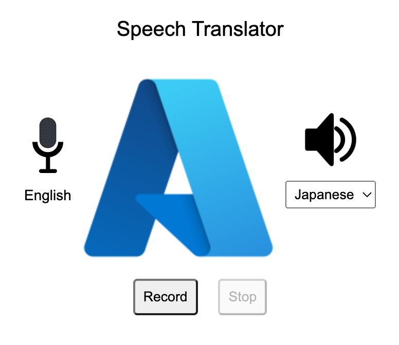

# azure-speech-translation

## 1. Setup 

### 1.1 Setup Python virtual environment
```
python3 -m venv .venv
```

### 1.2 Install libraries

```
source .venv/bin/activate
pip3 install -r requirements.txt
```

### 1.3 Install Azure Resources

1. Azure Cognitive Speech Service. Read this [blog](https://dennisvseah.blogspot.com/2022/10/azure-speech-to-text-service.html) for more information.
   1. Export the key and location values to `AZURE_SPEECH_KEY` and `AZURE_SPEECH_LOC`
1. Azure Cognitive Translation Service. Read this [blog](https://dennisvseah.blogspot.com/2022/10/azure-translation-service.html) for more information
   1. Export the key and location values to `AZURE_TRANSLATOR_KEY` and `AZURE_TRANSLATOR_LOC`

## 2. Starting Flask

```
python3 app.py
```

Point your browser to `http://127.0.0.1:5000`. You need to grant browser to access the microphone.



* Select the target language 
* Click `Record` button before speaking and `Stop` button when you are done.

In a few sound, you will hear the translated message.

